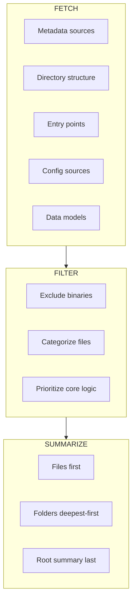

# Repo Wiki

Automatically generate comprehensive, multi-page wiki documentation for any codebase repository. Stop writing documentation by hand and get instant, grounded insights into what each file and folder does.

## Features

- **Automated Wiki Generation** — creates detailed summaries of repository purpose, structure, and core functionalities
- **Codebase Analysis** — identifies key files, functions, and their roles within the project using a FETCH → FILTER → SUMMARIZE pipeline
- **Dependency Graphs** — visualizes how files relate to each other using Mermaid diagrams
- **Multi-language Support** — output language matches the user's query (English, Chinese, Japanese, Korean, Russian detected automatically)
- **Grounded Content** — all technical content (paths, commands, env vars) is extracted from the actual repo, never invented

## Workflow



## Pages Generated

### Required (always created)

| Page | Purpose |
|------|---------|
| Overview | Project purpose, core capabilities, architecture |
| Quick Start | Prerequisites, installation, first run |
| Project Structure | Repository layout, entry points, module dependencies |
| Configuration | Config sources, env vars, precedence |
| Usage | Real usage scenarios with commands and output |
| Development | Dev workflow, module architecture, key areas |

### Optional (if detected in repo)

| Page | Trigger |
|------|---------|
| CLI Commands | `pyproject.toml` scripts, `package.json` bin, `Makefile` targets |
| API Reference | `__all__` exports, `api/` package, route definitions |
| Installation | Non-standard install, build-from-source |
| Troubleshooting | Existing FAQ/KNOWN_ISSUES, complex setup |
| FAQ | Existing Q&A content |
| Testing | `tests/` directory, test config files |
| Contributing | `CONTRIBUTING` file, `CODE_OF_CONDUCT` |

### Conditional (if component exists)

| Page | Trigger |
|------|---------|
| Deployment | `Dockerfile`, CI/CD workflows, k8s/helm configs |
| Architecture | 3+ packages with interdependencies, explicit architecture docs |
| Performance | Benchmark files, profiling config, perf-related flags |
| Advanced Topics | Plugin system, hooks, custom DSL |

## Quick Start

```bash
# Scaffold wiki structure (auto-detect language)
python3 scripts/scaffold_open_docs.py --query "Python CLI tool"

# Scaffold with explicit language
python3 scripts/scaffold_open_docs.py --lang zh --output .open_docs

# Force overwrite existing pages
python3 scripts/scaffold_open_docs.py --query "..." --force
```

Output goes to `./.open_docs/` in the project root.

## Directory Structure

```
repo-wiki/
├── SKILL.md                     # Core AI instructions and metadata
├── README.md                    # This file — human-readable guide
├── scripts/
│   └── scaffold_open_docs.py    # Wiki scaffolding script
└── references/
    └── wiki-template.md         # Full page templates, LLM prompt patterns, Mermaid examples
```

## Core Rules

- **Grounding**: All technical content from current repo — no invention
- **Language**: Output matches user query language; technical tokens stay as-is
- **No handoff**: Complete pages, no "see English version"
- **No hollow pages**: Meaningful content, not just stubs
- **No over-generation**: Only create pages that have grounding in the repo

## Supported Languages

| Language | Code | Detection |
|----------|------|-----------|
| English | `en` | Default (no CJK characters) |
| Chinese | `zh` | Unicode range `0x4E00`–`0x9FFF` |

Other languages (Japanese, Korean, Russian, etc.) fallback to English titles and UI strings.
