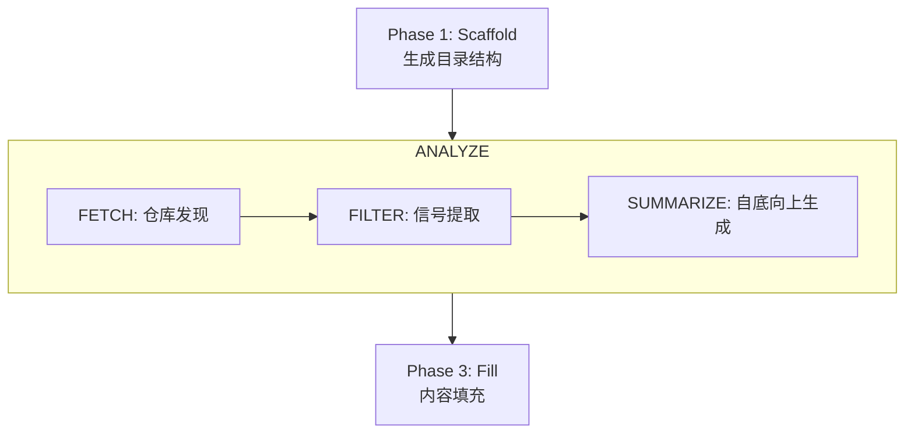

# Repo Wiki

为任意代码仓库自动生成完整的多页 wiki 文档。无需手动编写文档，即可获取关于每个文件和文件夹作用的真实、基于代码的分析。

## 特性

- **自动 Wiki 生成** — 创建仓库目的、结构和核心功能的详细摘要
- **代码库分析** — 通过 FETCH → FILTER → SUMMARIZE 流水线识别关键文件、函数及其在项目中的角色
- **依赖关系图** — 使用 Mermaid 图表可视化文件间的关系
- **多语言支持** — 输出语言与用户查询一致（英文和中文自动检测，其他语言需显式指定 `--lang`）
- **基于实际代码** — 所有技术内容（路径、命令、环境变量）均从真实仓库提取，绝不编造

## 工作流



## 生成的页面

### 必选页面（始终生成）

| 页面 | 用途 |
|------|------|
| Overview | 项目目的、核心能力、架构 |
| Quick Start | 前置条件、安装、首次运行 |
| Project Structure | 仓库布局、入口点、模块依赖 |
| Configuration | 配置源、环境变量、优先级 |
| Usage | 真实使用场景，含命令和输出 |
| Development | 开发工作流、模块架构、关键区域 |

### 可选页面（检测到对应指标时生成）

| 页面 | 触发条件 |
|------|---------|
| CLI Commands | `pyproject.toml` scripts、`package.json` bin、`Makefile` targets |
| API Reference | `__all__` 导出、`api/` 包、路由定义 |
| Installation | 非标准安装、从源码构建 |
| Troubleshooting | 现有 FAQ/KNOWN_ISSUES、复杂安装 |
| FAQ | 现有问答内容 |
| Testing | `tests/` 目录、测试配置文件 |
| Contributing | `CONTRIBUTING` 文件、`CODE_OF_CONDUCT` |

### 条件页面（组件存在时生成）

| 页面 | 触发条件 |
|------|---------|
| Deployment | `Dockerfile`、CI/CD 工作流、k8s/helm 配置 |
| Architecture | 3+ 个包且存在相互依赖、显式架构文档 |
| Performance | 基准测试文件、分析配置、性能相关标志 |
| Advanced Topics | 插件系统、钩子、自定义 DSL |

> 完整的检测条件表格请参阅 [SKILL.md](SKILL.md) 中的"自适应页面选择"章节。

## 快速开始

```bash
# 脚手架生成 wiki 结构（自动检测语言）
python3 scripts/scaffold_open_docs.py --query "Python CLI tool"

# 显式指定语言
python3 scripts/scaffold_open_docs.py --lang zh --output .open_docs

# 强制覆盖已有页面
python3 scripts/scaffold_open_docs.py --query "..." --force
```

输出到项目根目录的 `./.open_docs/`。

## 目录结构

```
repo-wiki/
├── SKILL.md                     # AI 核心指令和元数据
├── README.md                    # 本文件 — 人类可读指南
├── scripts/
│   └── scaffold_open_docs.py    # Wiki 脚手架脚本
├── tests/
│   └── test_scaffold.py         # 脚本单元测试
└── references/
    ├── wiki-template.md         # 完整页面模板、Mermaid 示例
    └── workflow.md              # 三阶段工作流程详细定义
```

## 核心规则

核心规则定义在 [SKILL.md](SKILL.md) 中，包括：

- 基于实际代码（不编造）
- 语言匹配用户查询
- 不转交（完整页面，无"见英文版"）
- 不生成空页
- 不超量生成

## 支持的语言

| 语言 | 代码 | 检测方式 |
|------|------|----------|
| 英文 | `en` | 默认（无 CJK 字符） |
| 中文 | `zh` | Unicode 范围 `0x4E00`–`0x9FFF` |

其他语言（日语、韩语、俄语等）需通过 `--lang` 显式指定，UI 字符串回退到英文。详见 [SKILL.md](SKILL.md) 中的"语言策略"章节。
