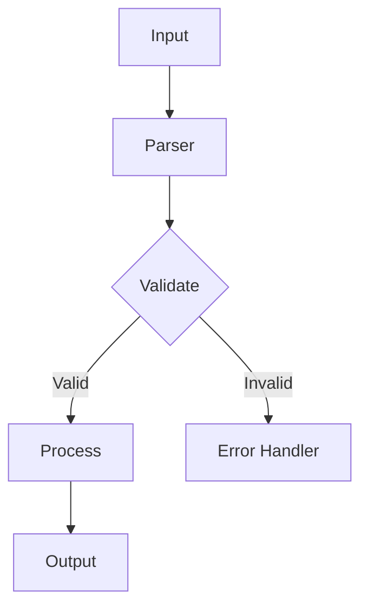
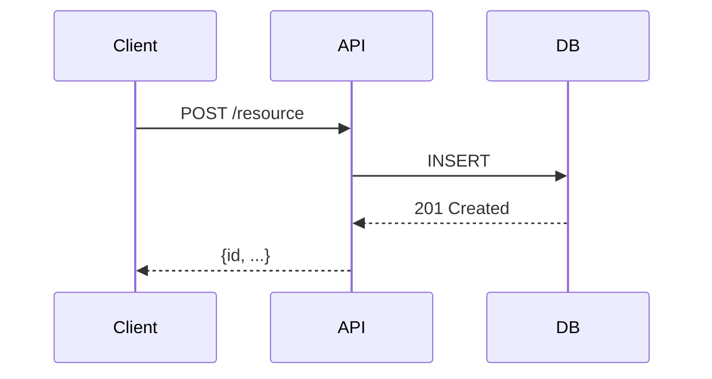
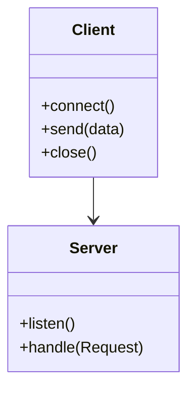

# Repo Wiki Template

Built-in template for generating a complete, professional project wiki grounded in the actual repository.

## Core Conventions

- Output directory: `./.open_docs`
- One page per file, plus `./.open_docs/index.md`
- Every page has a navigation line (prev/next/index) immediately below the H1
- Every page has a `<details>` block at the bottom listing **real file paths** found in the repo
- Use Mermaid diagrams for architecture and flows — never generate diagrams for content you don't actually understand from the code
- Missing sections: write a meaningful stub or omit the page; do not use "Not found in repo" as the only content on a required page

## Localization Rules

- H1 title, section headings, and prose are in the user's query language
- Technical tokens (module names, file paths, CLI commands, env vars) stay as-is from the code
- Navigation labels and UI strings use the localized equivalents from the template

---

## Page Templates

### 1. Overview

**Purpose:** Give the reader a clear, high-level picture of what this project is and what it can do.

**Minimum content threshold:** At least 3 substantive paragraphs. If you cannot write 3 paragraphs of real content, the project likely needs a more thorough read of the codebase.

**Where to ground this page:**

- `README.md` — purpose statement, key features table
- `pyproject.toml` / `package.json` / `Cargo.toml` — project name, version, description, keywords
- Main entry point (`main.py`, `index.js`, `main.go`) — what the app does at runtime
- Any existing docs or `docs/` directory
- Data models (`models/`, `schemas/`, `dataclasses`) — understand the domain before describing capabilities

**Section checklist:**

- [ ] **Project Purpose** — one paragraph: what problem does this solve?
- [ ] **Core Capabilities** — table with columns: Capability / Description / Location (module or file)
- [ ] **System Architecture** — Mermaid `flowchart TD` or `graph TD` showing top-level components and their relationships. Only include modules/packages you can confirm exist.
- [ ] **When to Use This Tool** — one paragraph on ideal use cases vs. alternatives

**If content is very sparse:** Write a compact 2-paragraph Overview and move on. Do not pad with invented details.

---

### 1.1 Quick Start

**Purpose:** Get a new user from zero to a working first run in the shortest time.

**Minimum content threshold:** Prerequisites + installation steps (or "no install required") + one working command example.

**Where to ground this page:**

- `README.md` — any existing install / getting-started steps
- `pyproject.toml` / `package.json` / `Makefile` — how to install or run
- `setup.py` / `build.sh` — build commands
- Env vars referenced in the entry point

**Section checklist:**

- [ ] **Prerequisites** — runtime version (Python 3.11+, Node 18+, Go 1.21+), required external tools
- [ ] **Installation** — exact commands to install, e.g. `pip install .` / `npm install` / `go install`
- [ ] **Basic Usage Example** — the simplest possible invocation with sample input/output
- [ ] **First Run** — what to expect on first execution; how to verify it worked

**Example (Python CLI):**

```markdown
## Prerequisites

- Python 3.11 or higher
- pip

## Installation

```bash
pip install .
```

## Basic Usage

```bash
$ mycli --help
usage: mycli [-h] [--config FILE] [--verbose] <command>

$ mycli init
Project initialized at ./myproject
```
```

---

### 2. Project Structure

**Purpose:** Orient the reader to the layout of the repository.

**Minimum content threshold:** Repository layout tree + at least 2 module/package descriptions.

**Where to ground this page:**

- `ls` the repo root — all top-level files and directories
- `pyproject.toml` / `package.json` — source layout config
- `src/` / `lib/` / `internal/` / `cmd/` — actual source directories
- Go: `go.mod`, package structure; Node: `src/`, `lib/`; Python: package layout

**Section checklist:**

- [ ] **Repository Layout** — tree view of the directory structure, pruned to meaningful entries (skip `__pycache__`, `.git`, `node_modules`, etc.)
- [ ] **Entry Points** — what file/module is executed when the CLI is invoked or the server starts
- [ ] **Module Dependencies** — brief description of each top-level package/module and its responsibility

---

### 2.1 CLI Commands *(optional — only if CLI entry points exist)*

**Purpose:** Document every CLI command, its arguments, and usage examples.

**Minimum content threshold:** At least 1 real command documented with args and an example.

**Where to ground this page:**

- `pyproject.toml` → `[project.scripts]` entries
- `setup.py` / `setup.cfg` → `entry_points`
- `package.json` → `bin` field
- `Makefile` → top-level targets (document targets with actual recipes)
- Executable files in `bin/`, `cmd/`, `scripts/`

**Section checklist:**

- [ ] **Command Overview** — table: Command / Purpose / Entry File
- [ ] **Per-command docs** — for each command:
  - Purpose statement
  - Syntax: `command [required] [--optional]`
  - Flag/argument table: Name / Type / Default / Description
  - One or more usage examples with real output

**Example structure:**

```markdown
## init

Initializes a new project configuration in the current directory.

**Syntax:** `mycli init [--template TMPL] [--force]`

| Flag | Type | Default | Description |
|------|------|---------|-------------|
| `--template` | string | `default` | Template name to use |
| `--force` | flag | `false` | Overwrite existing config |

**Example:**

```bash
$ mycli init --template web
Initialized web project at ./myproject
```
```

---

### 2.2 API Reference *(optional — only if public API exists)*

**Purpose:** Document public-facing functions, classes, routes, or endpoints.

**Minimum content threshold:** At least 1 real API entity documented.

**Where to ground this page:**

- `__all__` lists in Python modules
- `api.py` / `api/` package — route handlers
- OpenAPI / Swagger spec files
- Exported symbols in `lib/` or `internal/api/`

**Section checklist:**

- [ ] **Functions / Classes** — for each public symbol: signature, purpose, params, return value
- [ ] **Request / Response** (for HTTP APIs): method, path, body schema, status codes
- [ ] **Error codes** — named error constants and their meanings

**If the API is very small:** A single "Functions" table may suffice. Do not pad with invented endpoints.

---

### 3. Configuration

**Purpose:** Document all configuration sources, their precedence, and every known config key.

**Minimum content threshold:** At least one config source described with at least 2 real config keys.

**Where to ground this page:**

- Config file patterns: `.clirc`, `config.toml`, `settings.py`, `config/`
- Env vars referenced in code (`os.environ.get`, `os.getenv`)
- `pyproject.toml` / `package.json` — any custom sections
- Default values hard-coded in source

**Section checklist:**

- [ ] **Configuration Sources & Precedence** — list files/env vars in priority order
- [ ] **Config File Schema** — if a config file format is used, document its structure
- [ ] **Environment Variables** — table: Variable / Default / Description
- [ ] **Examples** — real config snippets found or inferred from the code

**Example:**

```markdown
## Environment Variables

| Variable | Default | Description |
|----------|---------|-------------|
| `MYCLI_LOG_LEVEL` | `INFO` | Logging level: DEBUG, INFO, WARN, ERROR |
| `MYCLI_CONFIG_PATH` | `~/.myclirc` | Path to config file |
```

---

### 3.1 Installation *(optional — only if non-standard install)*

**Purpose:** Cover installation paths beyond a simple package manager install.

**Minimum content threshold:** Prerequisites + at least 2 install methods or a non-trivial build step.

**Where to ground this page:**

- `README.md` — any non-standard install instructions
- `Makefile` — build/install targets
- `scripts/` — install/build helper scripts
- Docker-related files for containerized install

**Section checklist:**

- [ ] **Prerequisites** — system-level deps ( compilers, system libs)
- [ ] **Install Methods** — from source, from package, from container
- [ ] **Verify Installation** — how to confirm it worked

---

### 3.2 Deployment *(conditional — only if deployment configs exist)*

**Purpose:** Guide deployments to production or staging environments.

**Minimum content threshold:** At least one deployment method with real configuration.

**Where to ground this page:**

- `Dockerfile` — base image, build steps, entrypoint
- `docker-compose.yml` — services, ports, volumes
- `.github/workflows/deploy*.yml` — CI/CD deployment steps
- `k8s/`, `helm/`, `scripts/deploy*` — deployment manifests/scripts

**Section checklist:**

- [ ] **Environment-specific Configs** — env vars or flags for prod vs. dev
- [ ] **Secrets Management** — how secrets are injected (env vars, secrets manager, k8s secrets)
- [ ] **Deployment Workflow** — step-by-step from code to running instance

---

### 4. Usage

**Purpose:** Show the reader how to use the project for common, real workflows.

**Minimum content threshold:** At least 2 real usage scenarios with commands and expected output.

**Where to ground this page:**

- `README.md` — any usage examples
- `examples/` directory — if present
- CLI command implementations — map commands to their actual behavior
- Any demo scripts in `scripts/`

**Section checklist:**

- [ ] **Getting Started** — the simplest complete workflow
- [ ] **Core Workflows** — 2-3 most common use cases, each with a concrete example
- [ ] **Common Scenarios** — error handling for frequent mistakes, configuration tips

---

### 4.1 Troubleshooting *(optional — only if complex project)*

**Purpose:** Help users get unstuck without opening an issue.

**Minimum content threshold:** At least 2 real issues with solutions.

**Where to ground this page:**

- Existing `FAQ`, `TROUBLESHOOTING`, `KNOWN_ISSUES` files
- GitHub issues with `bug` label — recurring problems
- Error messages found in the codebase (`raise`, `error()`, `log.error`)

**Section checklist:**

- [ ] **Common Issues** — at least 2 real issues with symptoms and resolutions
- [ ] **Debug Commands** — how to collect diagnostic info (`--verbose`, `--debug`, log files)
- [ ] **Logging** — where logs go, how to increase log level

---

### 4.2 FAQ *(optional — only if existing Q&A content exists)*

**Purpose:** Answer questions that are frequently asked or would be frequently asked.

**Minimum content threshold:** At least 2 real Q&As. If none exist in the repo, do not generate this page.

**Where to ground this page:**

- Existing Q&A in `README.md`, `FAQ.md`, docs
- GitHub issues with `question` label

---

### 5. Development

**Purpose:** Help a new contributor get oriented and productive quickly.

**Minimum content threshold:** Dev workflow + at least 2 key areas described.

**Where to ground this page:**

- `CONTRIBUTING.md` — dev workflow
- `Makefile` — dev/test/lint targets
- `pyproject.toml` / `package.json` — dev dependencies
- Source code — key modules and their responsibilities

**Section checklist:**

- [ ] **Dev Workflow** — how to set up a dev environment, run the project locally, run tests
- [ ] **Module Architecture** — overview of how source is organized
- [ ] **Key Areas** — descriptions of the most important packages/modules and where to start

---

### 5.1 Testing *(optional — only if test suite exists)*

**Purpose:** Document how to run tests and what test types exist.

**Minimum content threshold:** At least one test command and at least 2 real test files.

**Where to ground this page:**

- `tests/`, `test/`, `*_test.py`, `*_test.go`, `*.spec.ts`
- `pytest.ini`, `setup.cfg`, `vitest.config.ts`, `jest.config.js`
- `pyproject.toml` → `pytest` section, `package.json` → `test` script

**Section checklist:**

- [ ] **Test Types** — unit, integration, e2e (mark all that exist in the repo)
- [ ] **How to Run Tests** — exact commands
- [ ] **Test Fixtures / Helpers** — location and purpose of any shared test utilities

---

### 5.2 Contributing *(optional — only if open source project)*

**Purpose:** Guide external contributors on how to contribute effectively.

**Minimum content threshold:** At least contribution types and a PR checklist.

**Where to ground this page:**

- `CONTRIBUTING.md`, `CODE_OF_CONDUCT.md`
- GitHub issue templates
- `Makefile` — lint/format targets

**Section checklist:**

- [ ] **Contribution Types** — bug reports, feature requests, code PRs, docs
- [ ] **PR Checklist** — lint, tests, changelog update, docs update

---

### 5.3 Architecture *(conditional — only for medium/large projects)*

**Purpose:** Explain the internal architecture for contributors who need to understand design decisions.

**Minimum content threshold:** Architectural layers + at least one Mermaid diagram.

**Where to ground this page:**

- `ARCHITECTURE.*`, `DESIGN.*` files
- Source code structure — package boundaries, interface definitions
- Any existing diagrams or design docs

**Section checklist:**

- [ ] **System Overview** — Mermaid `flowchart TD` showing top-level components and data flow
- [ ] **Architectural Layers** — description of each layer (e.g. "API → Service → Repository")
- [ ] **Key Design Patterns** — names and locations of recognizable patterns (e.g. Factory in `core/factory.py`, Observer in `events/`)

---

### 6. Advanced Topics *(conditional — only if applicable)*

**Purpose:** Deep-dive content for advanced users who need to extend or customize the project.

**Minimum content threshold:** At least 2 advanced topics with substantive content.

**Where to ground this page:**

- Plugin system — `plugins/`, `ext/`, `hooks/`
- Custom config DSL — parser/evaluator in source
- Advanced hooks or callbacks — `on_*` functions, event handlers

---

### 6.1 Performance *(conditional — only if performance-relevant components exist)*

**Purpose:** Document performance characteristics, benchmarks, and tuning options.

**Minimum content threshold:** At least 1 real benchmark result or tuning option.

**Where to ground this page:**

- `bench_*` files
- Profiling config (`profiling/`, `.pprof`)
- Performance-related env vars or flags
- `performance.md` if it exists

**Section checklist:**

- [ ] **Performance Characteristics** — known bottlenecks, time complexity of key operations
- [ ] **Benchmarks** — how to run, expected numbers
- [ ] **Tuning Tips** — env vars, config flags, resource limits

---

## Mermaid Diagram Guide

Use Mermaid for architecture diagrams, flowcharts, and sequence diagrams. Follow these rules:

### Flowchart (recommended for architecture)



### Sequence Diagram



### Class Diagram



**Rules:**

- Always use `flowchart`, `sequenceDiagram`, or `classDiagram` keyword on the first line — never bare `graph`
- Node labels in brackets `[text]` for flowcharts
- Arrow labels on the correct side of the arrow (`-->|label|`)
- Do not generate a diagram unless you understand the actual flow — if unsure, use a text description instead

---

## Relevant Source Files Block

Every page must end with a `<details>` block listing real file paths. Place it at the bottom of the page:

```md
<details>
<summary>相关源码文件</summary>

- `src/parser.py`
- `src/validator.py`
- `tests/test_parser.py`

</details>
```

Replace the placeholder paths with actual files you referenced while writing the page. If no files were referenced (e.g. Troubleshooting drawing from GitHub issues only), use `None — based on user reports and documentation only.`

---

## `--input` JSON Schema

The scaffold script accepts an optional `--input` JSON file for external wiki data integration (e.g. scraped from existing documentation systems).

### Structure

```json
{
  "wiki": {
    "wikis": {
      "en": {
        "pages": [
          {
            "page_plan": {
              "id": "1",
              "title": "Overview"
            }
          },
          {
            "page_plan": {
              "id": "1.1",
              "title": "Quick Start"
            }
          }
        ]
      },
      "zh": {
        "pages": [
          {
            "page_plan": {
              "id": "1",
              "title": "概述"
            }
          },
          {
            "page_plan": {
              "id": "1.1",
              "title": "快速开始"
            }
          }
        ]
      }
    }
  }
}
```

### Fields

| Field | Type | Required | Description |
|-------|------|----------|-------------|
| `wiki.wikis` | object | **Yes** | Language-keyed dictionary. Keys: `"en"`, `"zh"`, or any locale code. |
| `wikis.<lang>.pages` | array | **Yes** | Ordered list of page entries for this language. |
| `pages[].page_plan` | object | **Yes** | Page definition wrapper. |
| `page_plan.id` | string | **Yes** | Page ID matching a `### {id}.` heading in `wiki-template.md`, e.g. `"1"`, `"2.1"`. |
| `page_plan.title` | string | Yes | Human-readable page title, used in navigation and index. |

### Usage

```bash
python3 scripts/scaffold_open_docs.py --input ./scraped_wiki.json --query "Chinese project"
```

If the JSON is missing, malformed, or contains unrecognized page IDs, the script falls back to the bundled template and prints a warning to stderr.

---

## Language Detection Notes

The script detects **Chinese (zh)** and **English (en)** only. Detection uses the Unicode range `0x4E00-0x9FFF` (CJK Unified Ideographs).

- Queries containing CJK characters are detected as `zh`.
- All other queries default to `en`.
- Japanese, Korean, Russian, and other languages fallback to English titles and UI strings.

This is a deliberate design choice: the bundled template only provides full translations for en/zh. Adding more languages requires corresponding entries in `PAGE_TITLES` and `UI_TEXT`.
