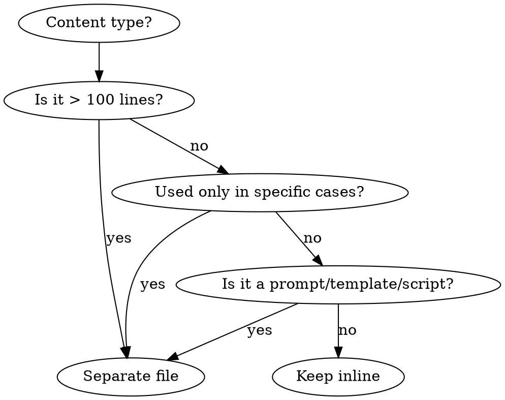

# Writing Skills

## Overview

**Writing skills IS Test-Driven Development applied to process documentation.**

**Personal skills live in agent-specific directories (`~/.claude/skills` for Claude Code, `~/.agents/skills/` for Codex)**

You write test cases (pressure scenarios with subagents), watch them fail (baseline behavior), write the skill (documentation), watch tests pass (agents comply), and refactor (close loopholes).

**Core principle:** If you didn't watch an agent fail without the skill, you don't know if the skill teaches the right thing.

**REQUIRED BACKGROUND:** You MUST understand test-driven-development before using this skill. That skill defines the fundamental RED-GREEN-REFACTOR cycle. This skill adapts TDD to documentation.

**Official guidance:** For Anthropic's official skill authoring best practices, see anthropic-best-practices.md. This document provides additional patterns and guidelines that complement the TDD-focused approach in this skill.

## What is a Skill?

A **skill** is a reference guide for proven techniques, patterns, or tools. Skills help future Claude instances find and apply effective approaches.

**Skills are:** Reusable techniques, patterns, tools, reference guides
**Skills are NOT:** Narratives about how you solved a problem once

## TDD Mapping for Skills

| TDD Concept | Skill Creation |
|-------------|----------------|
| **Test case** | Pressure scenario with subagent |
| **Production code** | Skill document (SKILL.md) |
| **Test fails (RED)** | Agent violates rule without skill (baseline) |
| **Test passes (GREEN)** | Agent complies with skill present |
| **Refactor** | Close loopholes while maintaining compliance |
| **Write test first** | Run baseline scenario BEFORE writing skill |
| **Watch it fail** | Document exact rationalizations agent uses |
| **Minimal code** | Write skill addressing those specific violations |
| **Watch it pass** | Verify agent now complies |
| **Refactor cycle** | Find new rationalizations → plug → re-verify |

The entire skill creation process follows RED-GREEN-REFACTOR.

## When to Create a Skill

**Create when:**
- Technique wasn't intuitively obvious to you
- You'd reference this again across projects
- Pattern applies broadly (not project-specific)
- Others would benefit

**Don't create for:**
- One-off solutions
- Standard practices well-documented elsewhere
- Project-specific conventions (put in CLAUDE.md)
- Mechanical constraints (if it's enforceable with regex/validation, automate it—save documentation for judgment calls)

## Skill Types

### Technique
Concrete method with steps to follow (condition-based-waiting, root-cause-tracing)

### Pattern
Way of thinking about problems (flatten-with-flags, test-invariants)

### Reference
API docs, syntax guides, tool documentation (office docs)

## Directory Structure

### Standard Layout (This Project's Convention)

```
skills/
  skill-name/
    SKILL.md              # Main entry point (required)
    references/           # Detailed reference docs (optional)
    scripts/              # Executable tools (optional)
    templates/            # Reusable templates (optional)
    [other supporting files]
```

**Flat namespace** - all skills in one searchable namespace

### What Goes Where (Progressive Disclosure)

**Keep in SKILL.md (always loaded):**
- Overview and core principles
- When to use (trigger conditions)
- Quick reference tables
- Core workflow (500 words max)
- Red flags and common mistakes
- Links to supporting files

**Move to separate files (loaded on demand):**
1. **`references/` directory** - Detailed step-by-step guides, comprehensive patterns
2. **`scripts/` directory** - Executable tools, utilities
3. **`templates/` directory** - Reusable templates
4. Prompt files - Subagent prompts, large examples
5. Heavy reference (100+ lines) - API docs, complete syntax

### Real Examples from This Codebase

**propose skill:** References separated into references/steps.md, references/spec-template.md, etc.
**systematic-debugging skill:** Techniques separated into root-cause-tracing.md, defense-in-depth.md, etc.
**subagent-driven-development skill:** Prompts as separate files, scripts in scripts/ directory

### Decision Tree: Inline vs Separate File



### Token Savings Example

**Before (all inline):**
- SKILL.md: 1500+ lines
- Loads everything into context every time

**After (progressive disclosure):**
- SKILL.md: ~300 lines (overview + quick reference)
- Only loads what's actually needed
- 80% token savings for typical usage

## SKILL.md Structure

**Frontmatter (YAML):**
- Two required fields: `name` and `description` (see [agentskills.io/specification](https://agentskills.io/specification))
- Max 1024 chars total
- `name`: letters, numbers, hyphens only
- `description`: Third-person, "Use when..." ONLY triggering conditions

**Sections to include:**
1. Overview - Core principle in 1-2 sentences
2. When to use - Symptoms and use cases
3. Core pattern - Before/after comparison if applicable
4. Quick reference - Table or bullets for scanning
5. Implementation - Inline code or links
6. Common mistakes - What goes wrong + fixes
7. Real-world impact (optional) - Concrete results

## Quick Reference

### CSO (Claude Search Optimization)
**See [references/cso-optimization.md](references/cso-optimization.md) for complete details**

- Description: "Use when..." ONLY, NO workflow summary
- Keywords: Error messages, symptoms, tools
- Naming: Active voice, verb-first (gerunds good)
- Token efficiency: SKILL.md < 500 words

### Testing Methodology
**See [references/testing-methodology.md](references/testing-methodology.md) for complete details**

- **Iron Law:** NO SKILL WITHOUT FAILING TEST FIRST
- RED: Baseline without skill, watch fail
- GREEN: Write minimal skill addressing failures
- REFACTOR: Close loopholes, add rationalization counters

### Skill Checklist
**See [references/skill-checklist.md](references/skill-checklist.md) for complete checklist**

- RED phase: Pressure scenarios, document failures
- GREEN phase: Minimal skill, test compliance
- REFACTOR phase: Close loopholes, re-test
- Quality checks: Progressive disclosure, < 500 lines

## The Iron Law

```
NO SKILL WITHOUT A FAILING TEST FIRST
```

**See [references/testing-methodology.md](references/testing-methodology.md) for complete testing guidance.**

## Flowchart Usage

**Use flowcharts ONLY for:**
- Non-obvious decision points
- Process loops
- "When to use A vs B" decisions

**Never use flowcharts for:** Reference material, code examples, linear instructions

See graphviz-conventions.dot for style rules. Use render-graphs.js to render diagrams.

## Code Examples

**One excellent example beats many mediocre ones**

Choose most relevant language (TypeScript/JS for testing, Shell/Python for system, Python for data). Keep examples complete, runnable, well-commented from real scenarios.

**Don't:** Multi-language, fill-in templates, contrived examples.

## Supporting Documents

- **[references/cso-optimization.md](references/cso-optimization.md)** - Complete CSO and token efficiency guide
- **[references/testing-methodology.md](references/testing-methodology.md)** - Complete testing, RED-GREEN-REFACTOR, rationalization defense
- **[references/skill-checklist.md](references/skill-checklist.md)** - Full deployment checklist
- **[testing-skills-with-subagents.md](testing-skills-with-subagents.md)** - Pressure scenario testing methodology
- **[anthropic-best-practices.md](anthropic-best-practices.md)** - Anthropic's official guidance
- **[persuasion-principles.md](persuasion-principles.md)** - Psychology for effective skill design

## Discovery Workflow

How future Claude finds your skill:
1. **Encounters problem** ("tests are flaky")
2. **Finds SKILL** (description matches)
3. **Scans overview** (is this relevant?)
4. **Reads patterns** (quick reference table)
5. **Loads example** (only when implementing)

**Optimize for this flow** - put searchable terms early and often.

## The Bottom Line

**Creating skills IS TDD for process documentation.**

Same Iron Law: No skill without failing test first.
Same cycle: RED (baseline) → GREEN (write skill) → REFACTOR (close loopholes).
Same benefits: Better quality, fewer surprises, bulletproof results.

If you follow TDD for code, follow it for skills. It's the same discipline applied to documentation.
